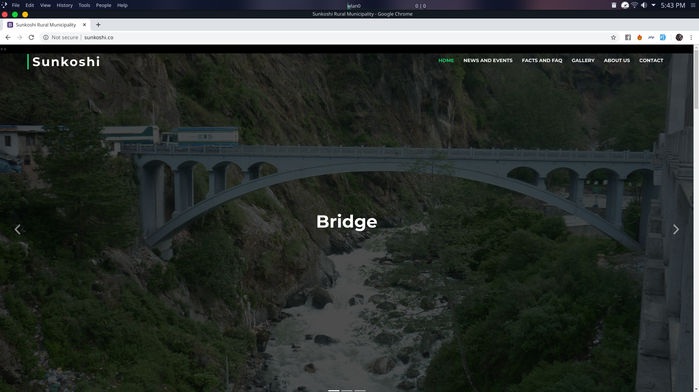
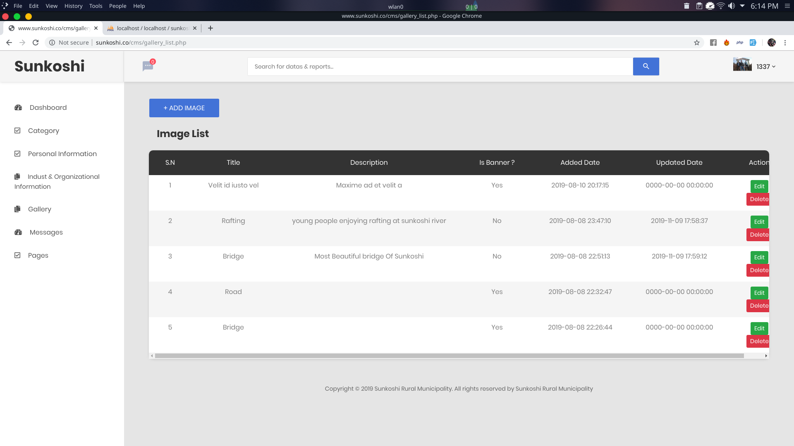

# Sunkhosi-College_Project
  The project is for a Sunkoshi Rural Municipality which is in Sindhupalchowk district. They want an online system ofdata collection along with the functionalities like view the records, edit and delete as per need. Data collection can be categorized as: personal, organizational, industrial etc. Personal details should include name, address, profession, date of birth etc. Organizational further can be broken down into government owned, private, educational, hospitals etc. Industrial may include the local level mini and micro industries. Record entry form, its view, edit, delete functionalities should be different for different categories
    
# Requiremnt to run Web Based Application
1. Xammp : XAMPP is a free and open-source cross-platform web server solution. 
2. Code Editor : to config server name , database. 

# Setup application
1. Clone Project (Sunkhosi-college_Project) 
2. First xampp server in computer from official link or [Click here to download](https://www.apachefriends.org/index.html) 
3. Install xampp and move cloned or downloaded files to xammp i.e C:\xampp\htdocs 
4. Now create a virtual host [click here to configure virtual host](https://www.wpwhitesecurity.com/multiple-websites-xampp/)
5. Configure Windows host file for virtual host [ click here for tut](https://www.wpwhitesecurity.com/windows-hosts-file/)
6. Open Xampp and Start Apache and MySql and browse localhost/phpmyadmin 
7. Create new database name as "sunkoshi" and import cloned "sunkoshi.sql" file and press go

8. Open Code editor and open source file and config/config.php and define according to yours as shown on below.
		
                            
9. Congratulation you are great !

# ScreenShots 
    
# FontEnd

     
# BackEnd
 
 
 
 
 
 
 
 
 
 
 
 
 # Code
    
    
 
 
 
 

 
 
 
